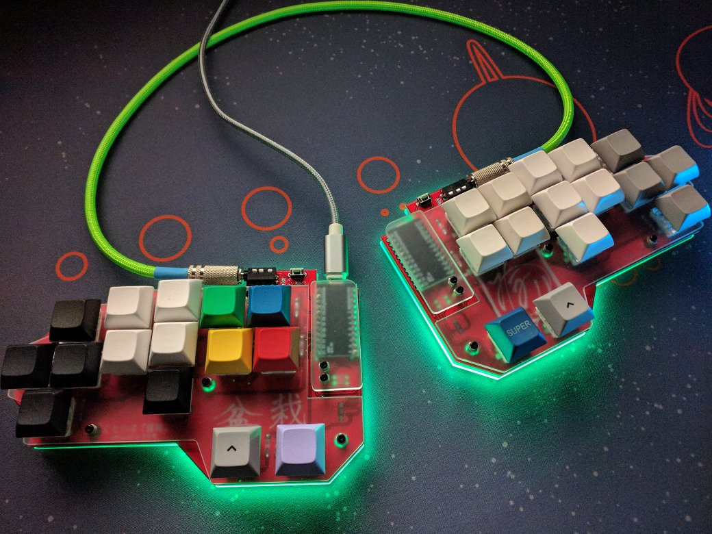
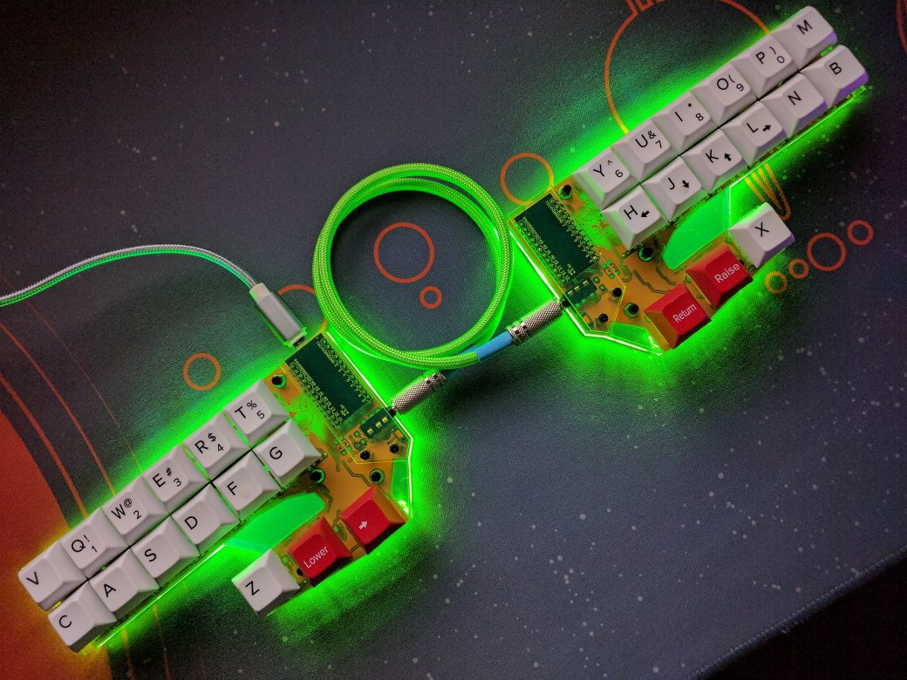
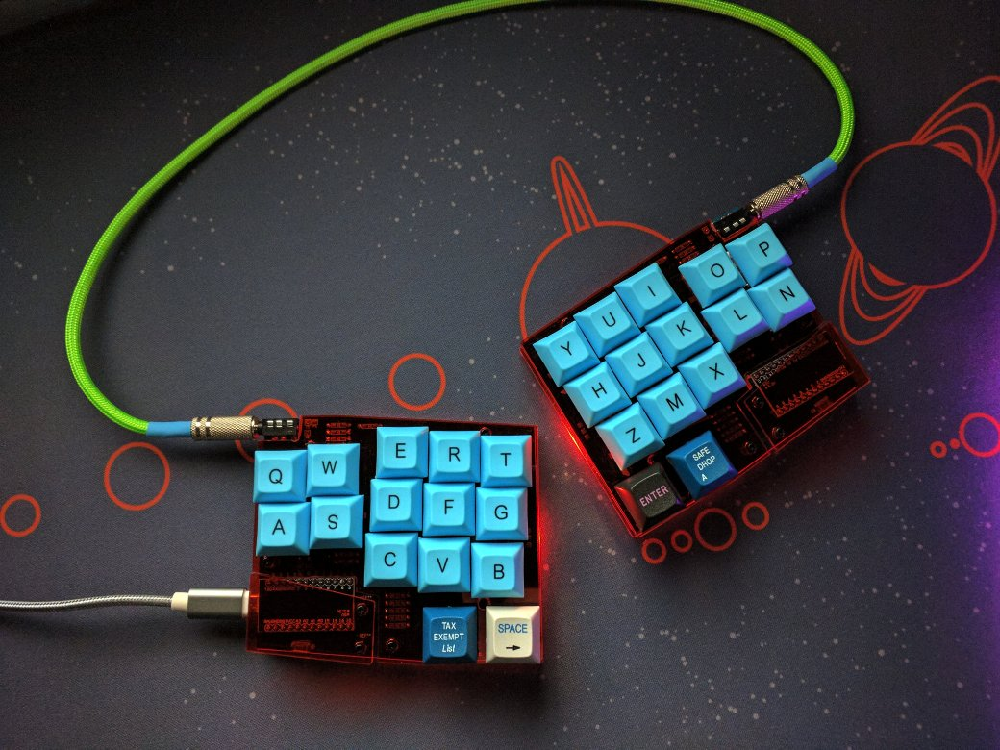

# ことのは キーボード(Kotonoha Keyboards)

My designed mechanical keyboards.

Firmware is [here](https://github.com/MasayukiFukada/qmk_firmware/tree/append_minamo_keymaps/keyboards/kotonoha) (QMK fork)  
※ `append_minamo_keymaps` branch

## ことのは 『盆栽』(Kotonoha - type "BONSAI")

* 30 % Keyboard (30 Key)
* FreeStyle Staggered
* PCB and Acrylic plate

## ことのは 『居合』(Kotonoha - type "IAI")

* 30 % Keyboard (30 Key)
* 6 x 2 OrtholinearBar
* PCB and Acrylic plate

## ことのは 『侘寂』(Kotonoha - type "WABISABI")

* 30 % Keyboard (30 Key)
* Matrix Staggered (Row x Column Staggered)
* PCB and Acrylic plate

## License

MIT

KiCad のフットプリントは [@foostan](https://github.com/foostan) さんのライブラリ  
[kbd](https://github.com/foostan/kbd) から使用させて頂きました。  
foostan さんありがとうございました。
